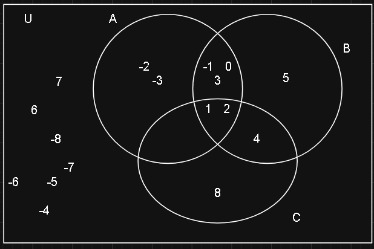
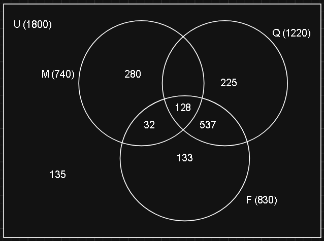
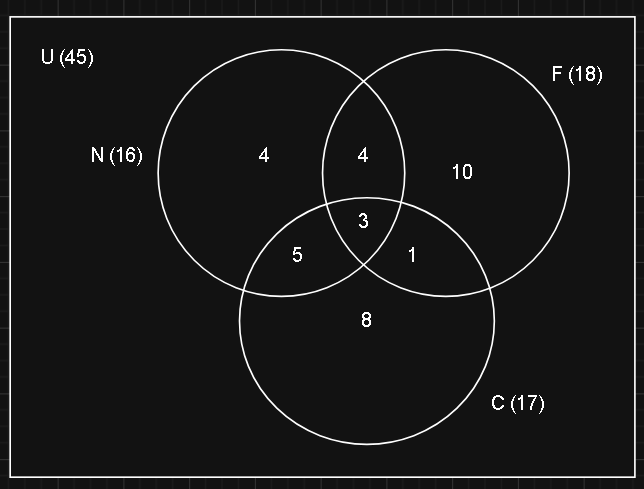
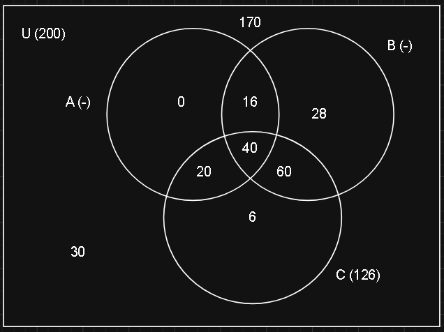

### 1) Considere los siguientes conjuntos:    
collapsed:: true
A = { x ∈ ℤ / x$^2$ < 10 } 
B = { x ∈ ℤ / │x - 2│ $\leq$ 3 } 
C = { x ∈ ℕ / x es divisor de 8 } 
Halle:
	- a) Cada uno de los conjuntos por extensión
	  collapsed:: true
		- A = {-1 , -2 , -3 , 0 , 1 , 2 , 3}
		  B = {5 , 4 , 3 , 2 , 1 , 0 , -1}
		  C = {1 , 2 , 4 , 8}
	- b) Sus intersecciones, A $\cap$ B , A $\cap$ C , B $\cap$ C, A $\cap$ B $\cap$ C
	  collapsed:: true
		- A $\cap$ B = {-1 , 0 , 1 , 2 , 3}
		  A $\cap$ C = {1 , 2}
		  B $\cap$ C = {1 , 2 , 4}
		  A $\cap$ B $\cap$ C = {1 , 2}
	- c) Sus uniones, A $\cup$ B, A $\cup$ C, B $\cup$ C, A $\cup$ B $\cup$ C
	  collapsed:: true
		- A $\cup$ B = {5 , 4 , 3 , 2 , 1 , 0 , -1 , -2 , -3 }
		  A $\cup$ C = {4 , 3 , 2 , 1 , 8 , -1 , -2 , -3}
		  B $\cup$ C = {5 , 4 , 3 , 2 , 1 , 0 , -1, 8}
		  A $\cup$ B $\cup$ C = {8 , 5 , 4 , 3 , 2 , 1 , 0 , -1, -2 , -3}
	- d) Las diferencias:   A – B,  B – A, A – C, C – A , B – C, C – B
	  collapsed:: true
		- A - B = {-2 , -3} 
		  B - A = {5 , 4}
		  A - C = {-1 , -2 , -3 , 0 , 3}
		  C - A = {5 , 4}
		  B - C = {5 , 3 , 0 , -1}
		  C - B = {8}
	- e) Tomando el Universal   U = { x ∈ ℤ / │x│ $\leq$ 8 }  halle los complementos de A, B y C.
	  collapsed:: true
		- U = {-8 , -7 , -6 , -5 , -4 , -3 , -2 , -1 , 0 , 1 , 2 , 3 , 4 , 5 , 6 , 7 , 8}
		  $\overline{A}$ = {-8 , -7 , -6 , -5 , -4 , 4 , 5 , 6 , 7 , 8}
		  $\overline{B}$ = {-8 , -7 , -6 , -5 , -4 , -3 , -2 , 6 , 7 , 8}
		  $\overline{C}$ = {-8 , -7 , -6 , -5 , -4 , -3 , -2 , -1 , 0 , 3 , 5 , 6 , 7}
	- f) Grafique los conjuntos mediante un diagrama de Venn
	  collapsed:: true
		- 
- ### 2) Sea A = { 1, 2 }  ,   B = { {1} , {2} }   y  C = { 1, 2, {1}, ∅ } 
  collapsed:: true
  Complete V o F, justificando:
	- a) A = B
	  collapsed:: true
		- *Falso*. B contiene 2 conjuntos que contienen a los elementos de A, pero no son los elementos de A.
	- b) A $\subseteq$ B
	  collapsed:: true
		- *Falso*. Mismo motivo que *a)*.
	- c) A $\subseteq$ C
	  collapsed:: true
		- *Verdadero*. Los elementos de A también están en C.
	- d) B $\subseteq$ C
	  collapsed:: true
		- *Falso*. El conjunto {2} de B no está en C.
	- e) ∅  $\subseteq$ A
	  collapsed:: true
		- *Verdadero*. El vacío esta incluido en todo conjunto.
	- f) ∅ ∈ A
	  collapsed:: true
		- *Falso*. Ya que no se encuentra el elemento vacío dentro de A.
	- g) ∅  $\subseteq$ C
	  collapsed:: true
		- *Verdadero*. Idem *e)*
	- h) ∅ ∈ C
	  collapsed:: true
		- *Verdadero*. Ya que es un elemento de C.
	- i) A $\cap$ B = ∅
	  collapsed:: true
		- *Verdadero*. Ya que ambos conjuntos no tienen elementos en común.
	- j) A $\cap$ C = A
	  collapsed:: true
		- *Verdadero*. Ya que A esta incluido en C.
	- k) C $\subseteq$ A $\cup$ B
	  collapsed:: true
		- *Falso*. Ya que el elemento Vacío no pertenece ni a A ni a B.
	- l) A – B = ∅
	  collapsed:: true
		- *Falso*. Ya que A – B = {1 , 2}.
	- m)  C – A $\subseteq$ B
	  collapsed:: true
		- *Falso*. Ya que el elemento vacío no pertenece a B.
	- n) │C – B│= 3
	  collapsed:: true
		- *Verdadero*. Ya que C – B = {2 , 1 , ∅}.
	- o) │A $\cup$ B $\cup$ C│= 4
	  collapsed:: true
		- *Falso*. Ya que son los 4 elementos de C mas el {2} de B, dando 5 elementos.
- ### 3) Represente y resuelva por conjuntos:
  collapsed:: true
	- a) De 1800 alumnos que se presentaron a rendir las tres materias para ingresar a una universidad, 740 aprobaron matemática, 830 aprobaron física y 1220 aprobaron química.  Los que aprobaron matemática y física pero no química fueron solo 32. Los que aprobaron física y química en total fueron 665, y los que aprobaron las tres fueron 128. Sabiendo que hubo 135 que no fueron capaces de aprobar siquiera una materia, calcule cuantos aprobaron únicamente matemática y no las otras dos.
	  collapsed:: true
		- | U | = 1800      *Total de alumnos*
		  id:: 69e69545-27ea-4bb8-be50-d876a77a7a27
		  | M | = 740      *Aprobaron Matemáticas*
		  | F | = 830      *Aprobaron Física*
		  | Q | = 1220      *Aprobaron Química*
		  | (M $\cap$ F) | - | (Q $\cap$ F $\cap$ M) |= 32      *Aprobaron Matemáticas y Física pero no Química*
		  | (Q $\cap$ F) | = 665      *Aprobaron Química y Física*
		  | (Q $\cap$ F) | - | (Q $\cap$ F $\cap$ M) |= 537      *Aprobaron Química y Física*
		  | (Q $\cap$ F $\cap$ M) | = 128      *Aprobaron las 3*
		  | U | - | (Q $\cup$ F $\cup$ M) | = 135      *No aprobaron nada*
		  | M - (Q $\cup$ F) | = ?
		  | (M $\cup$ Q)| = 32 + 128 + 537 = 697
		  | F | - | ((M $\cap$ F) $\cup$ (Q $\cap$ F))| = 830 - 697= 133       *Aprobaron solo Física*
		  | (M $\cup$ Q $\cup$ F) | = 1800 - 135 = 1665      *Todos los que aprobaron al menos 1 materia*
		  | M $\cup$ Q | = 1665 - 133 = 1532 *Aprobaron Química o Matemáticas*
		  | (M $\cup$ Q) | - | M | - | (Q $\cap$ F) - (Q $\cap$ F $\cap$ M)|= 1532 - 740 - 537 = 255       *Aprobaron solo Química*
		  | (M $\cup$ Q) | - | Q | - | (M $\cap$ F) - (Q $\cap$ F $\cap$ M)|= 1532 - 1220 - 32 = 280      *Aprobaron solo Matemáticas*
		  
	- b) Sobre un grupo de 45 personas se sabe que: 16 leen novelas, 18 leen ciencia ficción, 17 leen cuentos, 3 leen los tres géneros, 1 solo lee solo cuentos y ciencia ficción, 8 leen solo cuentos y 4 leen solo novelas y ciencia ficción. 
	  collapsed:: true
	  Se pregunta:
		- b.1) ¿Cuántas personas leen solo ciencia ficción?
			- 10
		- b.2) ¿Cuántas personas no leen ninguno de los tres géneros?
			- 10
		- b.3) ¿Cuántas personas leen por lo menos dos géneros 
		  distintos?
			- 13
		- b.4) ¿Cuántas personas leen novelas y cuentos pero no 
		  ciencia ficción?
			- 5
		- 
	- c) Una encuesta sobre 200 personas acerca del consumo de tres productos: alfajores, 
	  collapsed:: true
	  bombones y cupcakes reveló los siguientes datos:  126 consumen cupcakes, 124 no consumen alfajores, 36 no consumen ni alfajores ni bombones, 170 consumen por lo menos uno de los tres productos, 60 consumen alfajores y cupcakes, 40 consumen los tres productos y 56 no consumen bombones. Se pregunta:
		- c.1) ¿Cuántas personas consumen solo bombones?
			- 28
		- c.2) ¿Cuántas personas consumen alfajores y bombones?
		  collapsed:: true
			- 56
		- c.3) ¿Cuántas personas consumen solo alfajores?
		  collapsed:: true
			- 0
		- c.4) ¿Cuántas personas consumen alfajores y cupcakes 
		  collapsed:: true
		  pero no bombones?
			- 20
		- c.5) ¿Cuántas personas no consumen ninguno de los tres 
		  collapsed:: true
		  productos?
			- 30
		- 
	- )
- ### 4) Piense ejemplos de:
  collapsed:: true
	- a) Dos conjuntos infinitos cuya intersección sea infinita
	  collapsed:: true
		- A = { x / x ∈ x < 2 ∧ x ∈ ℝ }
		  B = { x / x ∈ x < 5 ∧ x ∈ ℤ }
		  A $\cap$ B = { x / x < 2 ∧ x ∈ ℤ }
	- b) Dos conjuntos infinitos cuya intersección sea finita
	  collapsed:: true
		- A = { x / x ∈ x < 2 ∧ x ∈ ℤ }
		  B = { x / x ∈ x > -2 ∧ x ∈ ℤ }
		  A $\cap$ B = { x / x < 2 ∧ x > -2 } = {-1 , 0 , 1}
	- c) Un conjunto infinito que este incluido en otro conjunto infinito y 
	  collapsed:: true
	  que su diferencia sea un conjunto infinito.
		- A = { x / x ∈ x < 2 ∧ x ∈ ℝ }
		  B = { x / x ∈ x < 2 ∧ x ∈ ℤ }
		  B $\subseteq$ A 
		  A - B = { x / x < 2 ∧  x ∈ ℝ ∧  x ∉ ℤ }
	- d) Un conjunto infinito que este incluido en otro conjunto infinito y 
	  collapsed:: true
	  que su diferencia sea un conjunto finito.
		- A = { x / x ∈ x < 2 ∧ x ∈ ℤ }
		  B = { x / x ∈ x < -2 ∧ x ∈ ℤ }
		  B $\subseteq$ A 
		  A - B = { x / x < 2 ∧ x > -2 } = { -1 , 0 , 1 }
- ### 5) Sea A = { 1, 2, 3, 4 }
  collapsed:: true
	- a) Halle el conjunto de Partes de A
		- P(A) = { A , ∅ , {1} , {2} , {3} , {4} , {1 , 2} , {1 , 3} , {1 , 4} , {2 , 3} , {2 , 4} , {3 , 4} , {1 , 2 , 3} , {1 , 2 , 4} , {2 , 3 , 4} , {1 , 3 , 4} }
	- b) De P(A) elija cinco conjuntos todos de distintos cardinales, de forma que tomados de a dos de ellos, siempre alguno este incluido en el otro.
	  collapsed:: true
		- ∅ $\subseteq$ {1} $\subseteq$  {1 , 3} $\subseteq$  {1 , 3} $\subseteq$  {1 , 3 , 4} $\subseteq$  A
	- c) Siendo A el conjunto referencial, halle el complemento de cada uno de los elementos 
	  collapsed:: true
	  de P(A).
		- $\overline{A}$ = ∅
		  id:: 69e6b980-b722-4c24-902a-2d9a4d71bd3c
		  $\overline{∅}$ = A
		  $\overline{(1)}$ = {2 , 3 , 4}
		  $\overline{(2)}$ = {1 , 3 , 4}
		  $\overline{(3)}$ = {1 , 2 , 4}
		  $\overline{(4)}$ = {1 , 2 , 3}
		  $\overline{(1 , 2)}$ = {3 , 4}
		  $\overline{(1 , 3)}$ = {2 , 4}
		  $\overline{(1 , 4)}$ = {2 , 3}
		  $\overline{(2 , 3)}$ = {1 , 4}
		  $\overline{(2 , 4)}$ = {1 , 3}
		  $\overline{(3 , 4)}$ = {1 , 2}
		  $\overline{(1 , 2 , 3)}$ = {4}
		  $\overline{(1 , 2 , 4)}$ = {3}
		  $\overline{(2 , 3 , 4)}$ = {1}
		  $\overline{(1 , 3 , 4)}$ = {2}
	- d) Calcule para cada X ∈ P(A), X $\subseteq$ B   siendo B={1,3}. Luego agrupe los conjuntos que tienen la misma intersección con B. ¿Cuántas intersecciones posibles con B hay?
	  collapsed:: true
		- X $\subseteq$ B = {∅ , {1} , {3} , {1 , 3} }
- ### 6) Demuestre las siguientes propiedades de Conjuntos, usando las definiciones y propiedades lógicas y justificando cada una en cada paso. Luego represente por diagramas de Venn para visualizar lo demostrado:
  collapsed:: true
	- a) A $\cap$ B $\subseteq$ A
	  collapsed:: true
		- ∀x:[ x ∈ (A $\cap$ B) ⇒ x ∈ A   *Def. de inclusión*
		  ⇒ x ∈ (A $\cap$ B)
		  ⇒ (x ∈ A ∧ x ∈ B)          *Def. de intersección*
		  ⇒ x ∈ A ]                      *Simplificación*
	- b)  ( A $\cup$  B ) $\cap$  C  = ( A $\cap$ C ) $\cup$ ( B $\cap$  C)
	  collapsed:: true
		- ∀x:[ x ∈ { ( A $\cup$  B ) $\cap$  C $\subseteq$ ( A $\cap$ C ) $\cup$ ( B $\cap$  C) } ∧ { ( A $\cap$ C ) $\cup$ ( B $\cap$  C) $\subseteq$  ( A $\cup$  B ) $\cap$  C }                    *Def. de igualdad de conjuntos*
		  x ∈ ( A $\cup$  B ) $\cap$  C ⇒ ( A $\cap$ C ) $\cup$ ( B $\cap$  C)         *Def. de inclusión*
		  x ∈ ( A $\cup$  B ) $\cap$  C
		  ⇔ ( x ∈ A ∨ x ∈ B ) ∧ x ∈ C     *Def. de intersección y unión*
		   ⇔ ( x ∈ A ∧ x ∈ C) ∨ ( x ∈ B ∧ x ∈ C )     *Distributividad*
		   ⇔ ( A $\cap$ C ) $\cup$ ( B $\cap$  C) ]     *Def. de intersección y unión*
	- c)  A $\cup$ ( A $\cap$  B ) = A
	  collapsed:: true
		- ∀x:[ x ∈ { A $\cup$ ( A $\cap$  B ) }
		  id:: 69e6c26d-f51f-4193-980b-b2357cc8de5d
		  ⇒ x ∈ A ∨ ( x ∈ A ∧ x ∈ B )          *Def. de intersección y unión*
		  ⇒ x ∈ A ]          *Absorción*
		- ∀x:[ x ∈ { A }
		  ⇒ x ∈ A ∨ ( x ∈ A ∧ x ∈ B )          *Adición*
	- d) ( X $\cap$ Y ) $\cup$ ( Y - X ) = Y
	  collapsed:: true
		- ∀x:[ x ∈ { ( X $\cap$ Y ) $\cup$ ( Y - X ) }
		  ⇔ ( x ∈ X ∧ x ∈ Y ) ∨ ( x ∈ Y ∧ x ∉ X ) )          *Def. de Unión, intersección y diferencia*
		  ⇔ ( x ∈ Y ∧ x ∈ X ) ∨ ( x ∈ Y ∧ x ∉ X ) )          *Conmutatividad*
		  ⇔ x ∈ Y ∧ ( x ∈ X  ∨ x ∉ X )         *Distributividad*
		  ⇔ x ∈ Y ∧ V          *Tercero excluido*
		  ⇔ x ∈ Y  ]      *Identidad*
	- e) $\overline{X}$ $\cap$ $\overline{Y}$ = $\overline{X \cap Y}$
	  collapsed:: true
		- ∀x:[ x ∈ ($\overline{X}$ $\cap$ $\overline{Y}$)
		  id:: 69e6d7a7-afdb-4638-b62b-582a6f4458ba
		  ⇔ x ∈ $\overline{X}$∧ x ∈ $\overline{Y}$       *Def. de intersección*
		  ⇔ x ∉ X ∧ x ∉ Y        *Def. de pertenencia*
		  ⇔ x ∉ ( X $\cap$ Y )         *Def. de intersección*
		  ⇔ x ∈ $\overline{X \cap Y}$ ]        *Def. de pertenencia*
	- f)  A – ( B $\cap$  C ) = ( A – B ) $\cup$  ( A – C )
	  id:: 69e6bc1a-b0a7-47c4-9653-535ca847a073
	  collapsed:: true
		- ∀x:[ x ∈ (A – ( B $\cap$  C ))
		  id:: 69e6d9f6-1e34-4059-842d-c1487fe478a8
		  ⇔ x ∈ A ∧ x ∉ ( B $\cup$  C )       *Def. de intersección y diferencia*
		  ⇔ x ∈ A ∧ ( x ∉ B ∨ x ∉ C ))       *Def. de unión*
		  ⇔ ( x ∈ A ∧ x ∉ B ) ∨ ( x ∈ A ∧ x ∉ C ))       *Distributividad*
		  ⇔ x ∈ ( A - B ) ∨ x ∈ ( A - C ))       *Def. de diferencia*
		  ⇔ x ∈ (( A - B ) $\cup$ ( A - C ))  ]   *Def. de unión*
- ### 7) Demuestre los siguientes condicionales o bicondicionales, justificando todas las propiedades utilizadas:
	- a) A $\subseteq$ C ∧ B $\subseteq$ D ⇒ A $\cup$ B $\subseteq$ C $\cup$ D
	- b) ( A – B ) U ( A $\cap$ B ) = B  ⇒ B $\subseteq$ A
	- c) A = $\overline{C}$ $\cap$ ( B $\cup$ C)  ⇒ A $\subseteq$ B
	- d) Y $\subseteq$ X ⇔ $\overline{X}$ $\cap$ Y = ∅
	- e) A $\cup$ $\overline{B}$ = $\overline{B}$  ⇔  A $\cap$ B = ∅