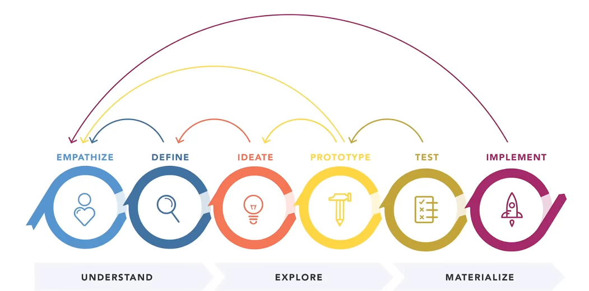

- 
- Es un proceso iterativo entre todas las etapas de la metodología.
- Las etapas del diseño son las siguientes:
	- 1- Empatizar:
		- Investigar  las  necesidades  de  los  usuarios.
		  El equipo busca entender el problema, generalmente mediante investigación de usuarios.
		  La empatía es clave porque permite a los diseñadores dejar de lado sus propias suposiciones y comprender mejor a los usuarios y sus necesidades.
	- 2- Definir:
		- Establecer  las  necesidades  y  problemas  de  los  usuarios.
		  Una vez recopilada la información, el equipo analiza las observaciones y las sintetiza para definir los problemas principales.
		  Estas definiciones se llaman declaraciones del problema.
		  El equipo busca el enfoque centrado en el usuario.
	- 3- Idear:
		- Cuestionar  suposiciones  y  crear  ideas.
		  Con una base clara del problema, el equipo comienza a pensar de manera creativa.
		  Se generan ideas y se buscan formas alternativas de ver el problema para encontrar soluciones innovadoras.
	- 4- Prototipar:
		- Comenzar  a  crear  soluciones. Es una fase experimental.
		  El objetivo es encontrar la mejor solución posible para cada problema.
		  El equipo crea versiones simples y económicas del producto o de algunas funciones para probar las ideas.
	- 5- Probar:
		- Evaluar  las  soluciones. El equipo prueba los prototipos con usuarios reales para ver si resuelven el problema.
		  Las pruebas pueden revelar nuevas ideas, lo que puede llevar a mejorar el prototipo o incluso volver a etapas anteriores.
		- Comenzar  a  crear  soluciones. Es una fase experimental.
		  El objetivo es encontrar la mejor solución posible para cada problema.
		  El equipo crea versiones simples y económicas del producto o de algunas funciones para probar las ideas.
	- 6- Implementar:
		- En esta etapa se implementa todo el diseño previo, se miden indicadores, y se efectúa una retroalimentación del sistema.