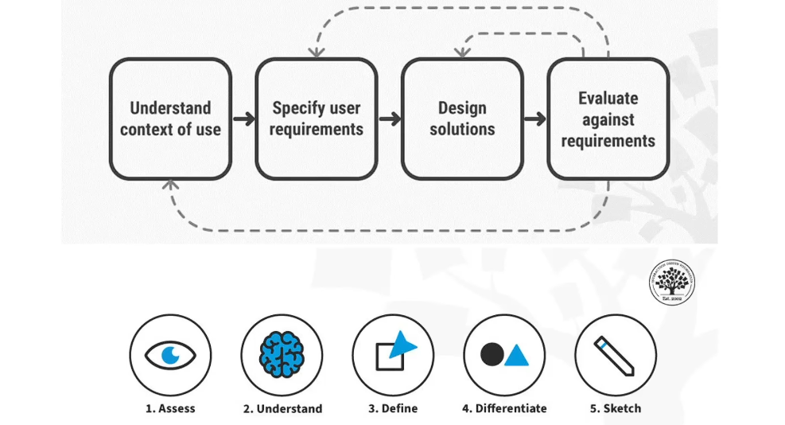

- 
- La idea principal es diseñar basándose en las necesidades, comportamientos y contexto real de los usuarios, no en suposiciones.
- Según la norma [[ISO 9241-210 , el proceso tiene 4 etapas principales:
	- 1- Comprender el contexto de uso:
		- Se investiga quién usará el producto, para qué y en qué entorno.
		  Ejemplos de actividades: entrevistas con usuarios, encuestas, observación, análisis de tareas.
		  Objetivo: entender usuarios, objetivos y contexto.
	- 2- Especificar  los  requisitos  del  usuario:
		- Con la información obtenida se definen qué necesita realmente el usuario.
		  Se suelen crear: personas, user journeys, requisitos de usabilidad.
		  Objetivo: definir qué debe resolver el producto.
	- 3- Diseñar  soluciones:
		- Se proponen posibles soluciones y se diseñan interfaces.
		  Herramientas comunes: wireframes, prototipos, arquitectura de información, flujos de usuario.
		  Objetivo: crear posibles soluciones al problema.
	- 4- Evaluar  el  diseño:
		- Se prueban las soluciones con usuarios reales.
		  Ejemplos: tests de usabilidad, entrevistas de feedback, análisis de comportamiento.
		  Objetivo: verificar si el diseño realmente funciona para el usuario.